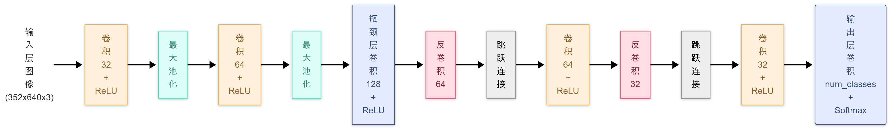
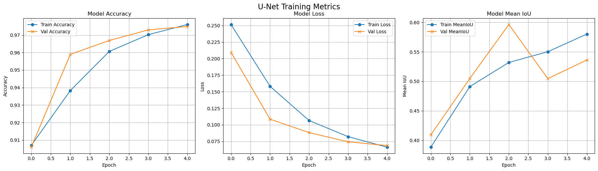
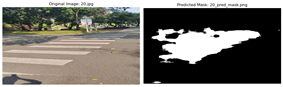
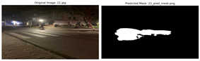
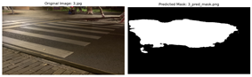
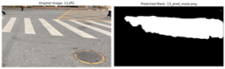

[English](#english) | [中文](#中文)

---
## English <a name="english"></a>

# U-Net Implementation for Zebra Crossing Semantic Segmentation (zebra_crossing-with-U-net)

This project implements a semantic segmentation model based on the U-Net architecture using TensorFlow and Keras to automatically extract zebra crossing regions from road scene images captured by vehicle-mounted cameras.

## Project Overview

This project aims to:

1.  Implement the classic U-Net model for image semantic segmentation tasks.
2.  Train the model on the CDSet dataset to recognize zebra crossings.
3.  Provide complete code for data preprocessing, model training, batch prediction on new images, and result visualization.
4.  Explore performance optimization strategies, including mixed-precision training.

## Features

*   U-Net model implementation based on TensorFlow/Keras.
*   **Includes a preprocessing script (`process_label.ipynb`) to convert CDSet's YOLO format labels into PNG masks.**
*   Includes an optional image resizing tool script (`process_label.ipynb`).
*   Uses `tf.data` to build efficient data loading and preprocessing pipelines.
*   Supports GPU acceleration and mixed-precision training (requires compatible hardware and CUDA environment).
*   Provides model training and evaluation script (`U_net.ipynb`).
*   Provides script for batch prediction on new images (`U_net.ipynb`, latter part), saving predicted masks as image files.
*   Provides visualization script (`U_net.ipynb`) to compare original images, ground truth masks (during training), and prediction results.

## Dataset

*   **Source**: Uses the **CDSet (Crosswalk DataSet for Zebra Crossing Detection)** dataset published by Shanghai Jiao Tong University in 2022.
*   **Content**: Contains 3080 training images and 354 test images, all road scenes captured by vehicle-mounted cameras. Original labels are in YOLO txt format.
*   **Preprocessing**: This project provides the `process_label.ipynb` script to convert the original YOLO txt labels into **single-channel grayscale PNG mask images** required for training (background pixel value 0, zebra crossing pixel value 1).
*   **Resolution**:
    *   The label preprocessing script (`process_label.ipynb`, Cell 2) generates masks with **352x640** resolution.
    *   Model training and prediction (`U_net.ipynb`) are both performed at **352x640** resolution.
*   **Download Link**: [https://zenodo.org/records/8289874](https://zenodo.org/records/8289874)

## File Structure Explanation

```
zebra_crossing-with-U-net/
├── process_label.ipynb       # Contains: 1. General image resizing tool 2. CDSet YOLO label to PNG mask conversion script
├── U_net.ipynb               # Contains: U-Net model definition, training process, test set evaluation, batch prediction on new images & visualization
├── image/
│   ├── accuracy.png          # Example: Training curves
│   ├── U-net.png             # Example: U-Net model architecture diagram
│   ├── 图片1.png             # Example: Result visualization 1
│   ├── 图片2.png             # Example: Result visualization 2
│   ├── 图片3.png             # Example: Result visualization 3
│   ├── 图片4.png             # Example: Result visualization 4
│   └── 图片5.png             # Example: Result visualization 5
├── requirements.txt          # List of project dependencies
├── unet_crosswalk_model_final.h5 # Trained model file (example name)
└── README.md                 # This documentation file (containing both languages)

# --- Required dataset directory structure (outside the repository) ---
<your_base_path>/dataset_YOLO_format_3434/
├── images/
│   ├── train/                # Store original training images (*.jpg, *.png)
│   └── test/                 # Store original test images (*.jpg, *.png)
├── labels/                   # Store original YOLO format label files
│   ├── train/                # (*.txt)
│   └── test/                 # (*.txt)
└── masks_crosswalk/          # <--- Generated after running process_label.ipynb
    ├── train/                # Store preprocessed training masks (*.png, 352x640, 0/1)
    └── test/                 # Store preprocessed test masks (*.png, 352x640, 0/1)

# --- Directory for new images to predict and results (example, outside or inside repo) ---
<your_prediction_input_path>/CampusZebra_new/  # Store images for prediction (e.g., resized to 1280x720 or any size)
<your_prediction_output_path>/CampusZebra_result/ # Store predicted mask images (*_pred_mask.png)
```
*(Note: Added result image examples to the file structure)*

## Environment Requirements and Setup

1.  **Python**: Recommended Python 3.8 - 3.10.
2.  **Main Libraries**:
    *   TensorFlow (>= 2.6, GPU version `tensorflow-gpu` recommended)
    *   NumPy
    *   Matplotlib (for visualization)
    *   Pillow (PIL) (for image processing)
    *   OpenCV (`opencv-python`) (for image scaling in `process_label.ipynb`)
    *   tqdm (for progress bars in `process_label.ipynb`)
    Recommended installation using `requirements.txt`:
    ```txt
    # requirements.txt
    tensorflow>=2.6.0 # or tensorflow-gpu
    numpy
    matplotlib
    Pillow
    opencv-python
    tqdm
    ipykernel # If running .ipynb in VS Code or Jupyter
    ```
    Run: `pip install -r requirements.txt`
3.  **Hardware**: An NVIDIA GPU supporting CUDA (Compute Capability >= 7.0 for mixed precision) is highly recommended for training and prediction. Ensure NVIDIA drivers, CUDA Toolkit, and cuDNN are correctly installed.
4.  **Clone Repository**: `git clone https://github.com/YihangLiu-giser/zebra_crossing-with-U-net.git`
5.  **Dataset Preparation**:
    *   Download and extract the CDSet dataset.
    *   Place the extracted `images` and `labels` folders under `<your_base_path>/dataset_YOLO_format_3434/` as shown in the "File Structure Explanation".
    *   **Run Label Preprocessing**:
        *   Open `process_label.ipynb`.
        *   **Check and modify `base_path` in Cell 2** to point to your `dataset_YOLO_format_3434` folder.
        *   **Run Cell 2**. This will read `.txt` files from `labels/train` and `labels/test`, generate corresponding PNG masks (352x640), and save them to `masks_crosswalk/train` and `masks_crosswalk/test`.

## Usage Instructions

1.  **Model Training**:
    *   Open `U_net.ipynb`.
    *   **Check and modify `base_path` in Cell 1** to point to your `dataset_YOLO_format_3434` folder.
    *   (Optional) Adjust training parameters like `BATCH_SIZE`, `EPOCHS`, etc.
    *   Run the notebook cells sequentially up to the cell containing the `train_model()` call.
    *   The training progress (loss and metrics per epoch) will be logged in the console.
    *   After training completes, the model weights will be saved in the project root directory (e.g., `unet_crosswalk_model_final.h5`), and training/validation curves will be displayed.

2.  **Prediction on New Images**:
    *   Prepare a folder containing the images you want to predict (e.g., `D:\Class\CV\Task2\CampusZebra_new`). Note: These images **do not** need to be pre-resized to 352x640; the prediction script handles resizing internally.
        *   (Optional) Cell 1 in `process_label.ipynb` can be used to pre-resize these images (e.g., to 1280x720), but this is **not** required for the prediction process.
    *   Continue running cells in `U_net.ipynb`.
    *   **Check and modify the following variables in Cell 6 (`# Apply to your own images ...`)**:
        *   `MODEL_PATH`: Ensure it points to your trained model file (`.h5`).
        *   `INPUT_IMAGE_DIR`: Point to the folder containing the **images to be predicted**.
        *   `OUTPUT_MASK_DIR`: Point to the folder where you want to **save the predicted masks** (the script will create it if it doesn't exist).
        *   (Optional) `NUM_SAMPLES_TO_SHOW`: Controls how many prediction results are visualized at the end.
    *   **Set `run_prediction = True`** (within the `if __name__ == "__main__":` block at the end of Cell 6) to execute prediction. Keep it `False` if you only want to visualize existing prediction results.
    *   Run Cell 6 and subsequent relevant cells.
    *   The script will load the model, process each image in `INPUT_IMAGE_DIR`, perform prediction, and save the generated grayscale mask images (zebra crossings as white/255) to `OUTPUT_MASK_DIR` with filenames like `<original_filename>_pred_mask.png`.

3.  **Result Visualization**:
    *   After prediction is complete (or if you already have prediction results), ensure Cell 6中的 `INPUT_IMAGE_DIR` and `OUTPUT_MASK_DIR` point to the correct paths.
    *   Run the part of Cell 6 that calls `visualize_predictions`.
    *   You will see side-by-side comparisons of original images and their corresponding predicted masks in the notebook output or a popped-up Matplotlib window. (This refers to the programmatic visualization, separate from the static images below).

## Model Architecture (U-Net)

This model is based on the standard U-Net architecture:

*   **Encoder**: 4 down-sampling blocks, each containing two 3x3 ReLU convolutions followed by one 2x2 max pooling. Channel count increases from 32 to 512.
*   **Bottleneck**: Two 3x3 ReLU convolutions with 512 channels.
*   **Decoder**: 4 up-sampling blocks, each containing one 2x2 transpose convolution, concatenation with the corresponding encoder feature map (Skip Connection), and two 3x3 ReLU convolutions. Channel count decreases from 256 to 32.
*   **Output Layer**: A 1x1 convolution maps channels to `NUM_CLASSES=2`, followed by `softmax` activation for pixel-wise probabilities, and finally a `linear` activation to ensure float32 output compatible with mixed precision.
*   **Parameter Count**: Approximately 7.76 million.
*   

## Experimental Results and Evaluation

*   **Training Performance**: On an NVIDIA RTX 30 series GPU with mixed precision enabled, using the adjusted resolution (352x640) and Batch Size (8), each training epoch takes approximately 70-80 seconds.
*   **Evaluation Metrics** (on CDSet test set, after 5 epochs):
    *   **Loss**: Training and validation loss decreased steadily.
    *   **Pixel Accuracy**: Reached nearly 0.98 on the validation set.
    *   **Mean Intersection over Union (MeanIoU)**: Validation MeanIoU reached around 0.62 (this is a key metric for evaluating segmentation quality).
*   **Visualization Results**:
    *   The model performs well on clear, unobstructed zebra crossings.
    *   Performance may degrade under complex conditions like varying illumination, shadows, partial occlusions, road wear, etc., potentially leading to less precise segmentation boundaries or missed/false detections.
    *   

*Partial Result Visualization*  
  
  
  
  
  

---
## 中文 <a name="中文"></a>

# U-Net 实现斑马线语义分割 (zebra_crossing-with-U-net)

本项目使用 TensorFlow 和 Keras 实现了一个基于 U-Net 架构的语义分割模型，用于从车载摄像头采集的道路场景图像中自动提取斑马线区域。

## 项目概述

本项目旨在：

1.  实现经典的 U-Net 模型用于图像语义分割任务。
2.  在 CDSet 数据集上训练模型以识别斑马线。
3.  提供数据预处理、模型训练、对新图像进行批量预测以及结果可视化的完整流程代码。
4.  探索包括混合精度训练在内的性能优化策略。

## 特点

*   基于 TensorFlow/Keras 的 U-Net 模型实现。
*   **包含将 CDSet 的 YOLO 格式标签转换为 PNG 掩码的预处理脚本 (`process_label.ipynb`)**。
*   包含可选的图像尺寸调整工具脚本 (`process_label.ipynb`)。
*   使用 `tf.data` 构建高效的数据加载与预处理管道。
*   支持 GPU 加速和混合精度训练 (需要兼容的硬件和 CUDA 环境)。
*   提供模型训练和评估脚本 (`U_net.ipynb`)。
*   提供对新图像进行批量预测的脚本 (`U_net.ipynb` 后半部分)，可将预测掩码保存为图像文件。
*   提供可视化脚本 (`U_net.ipynb`)，用于对比原始图像、真实掩码（训练时）和预测结果。

## 数据集

*   **来源**: 选用 2022 年上海交通大学发布的 **CDSet (Crosswalk DataSet for Zebra Crossing Detection)** 数据集。
*   **内容**: 包含 3080 张训练图像和 354 张测试图像，均为车载摄像头采集的道路场景。原始标签为 YOLO txt 格式。
*   **预处理**: 本项目提供了 `process_label.ipynb` 脚本，用于将原始的 YOLO txt 标签转换为训练所需的 **PNG 格式单通道灰度掩码图像** (背景像素值为 0, 斑马线像素值为 1)。
*   **分辨率**:
    *   标签预处理脚本 (`process_label.ipynb`, Cell 2) 生成 **352x640** 分辨率的掩码。
    *   模型训练和预测 (`U_net.ipynb`) 均在 **352x640** 分辨率下进行。
*   **下载地址**: [https://zenodo.org/records/8289874](https://zenodo.org/records/8289874)

## 文件结构说明

```
zebra_crossing-with-U-net/
├── process_label.ipynb       # 包含：1. 通用图像尺寸调整工具 2. CDSet YOLO标签到PNG掩码的转换脚本
├── U_net.ipynb               # 包含：U-Net模型定义、训练流程、测试集评估、对新图像的批量预测与可视化
├── image/
│   ├── accuracy.png          # 示例：训练曲线 (原文件名: 精度.png)
│   ├── U-net.png             # 示例：U-Net模型结构图
│   ├── 图片1.png             # 示例：结果可视化 1
│   ├── 图片2.png             # 示例：结果可视化 2
│   ├── 图片3.png             # 示例：结果可视化 3
│   ├── 图片4.png             # 示例：结果可视化 4
│   └── 图片5.png             # 示例：结果可视化 5
├── requirements.txt          # 项目依赖库列表
├── unet_crosswalk_model_final.h5 # 训练后保存的模型文件 (示例名称)
└── README.md                 # 本说明文件

# --- 需要用户准备的数据集目录结构 (在仓库外部) ---
<your_base_path>/dataset_YOLO_format_3434/
├── images/
│   ├── train/                # 存放原始训练图像 (*.jpg, *.png)
│   └── test/                 # 存放原始测试图像 (*.jpg, *.png)
├── labels/                   # 存放原始 YOLO 格式标签文件
│   ├── train/                # (*.txt)
│   └── test/                 # (*.txt)
└── masks_crosswalk/          # <--- 运行 process_label.ipynb 后生成
    ├── train/                # 存放预处理后的训练掩码 (*.png, 352x640, 0/1)
    └── test/                 # 存放预处理后的测试掩码 (*.png, 352x640, 0/1)

# --- 用于预测的新图像和结果目录 (示例，在仓库外部或内部) ---
<your_prediction_input_path>/CampusZebra_new/  # 存放待预测的图像 (例如，已调整为1280x720或任意尺寸)
<your_prediction_output_path>/CampusZebra_result/ # 存放预测生成的掩码图像 (*_pred_mask.png)
```
*(Note: Added result image examples to the file structure)*

## 环境要求与设置

1.  **Python**: 推荐 Python 3.8 - 3.10。
2.  **主要库**:
    *   TensorFlow (>= 2.6, 推荐 GPU 版本 `tensorflow-gpu`)
    *   NumPy
    *   Matplotlib (用于可视化)
    *   Pillow (PIL) (用于图像处理)
    *   OpenCV (`opencv-python`) (用于 `process_label.ipynb` 中的图像缩放)
    *   tqdm (用于 `process_label.ipynb` 中的进度条)
    建议使用 `requirements.txt` 安装:
    ```txt
    # requirements.txt
    tensorflow>=2.6.0 # 或者 tensorflow-gpu
    numpy
    matplotlib
    Pillow
    opencv-python
    tqdm
    ipykernel # 如果在 VS Code 或 Jupyter 中运行 .ipynb
    ```
    运行: `pip install -r requirements.txt`
3.  **硬件**: 强烈推荐使用支持 CUDA 的 NVIDIA GPU (Compute Capability >= 7.0 以支持混合精度) 进行训练和预测。确保已正确安装 NVIDIA 驱动、CUDA Toolkit 和 cuDNN。
4.  **克隆仓库**: `git clone https://github.com/YihangLiu-giser/zebra_crossing-with-U-net.git`
5.  **数据集准备**:
    *   下载 CDSet 数据集并解压。
    *   将解压后的 `images` 和 `labels` 文件夹放入 `<your_base_path>/dataset_YOLO_format_3434/` 目录下，如上文 "文件结构说明" 所示。
    *   **运行标签预处理**:
        *   打开 `process_label.ipynb`。
        *   **检查并修改 Cell 2 中的 `base_path`**，使其指向你的 `dataset_YOLO_format_3434` 文件夹。
        *   **运行 Cell 2**。这将读取 `labels/train` 和 `labels/test` 中的 `.txt` 文件，生成对应的 PNG 掩码 (352x640) 并保存到 `masks_crosswalk/train` 和 `masks_crosswalk/test` 目录中。

## 使用说明

1.  **模型训练**:
    *   打开 `U_net.ipynb`。
    *   **检查并修改 Cell 1 中的 `base_path`**，使其指向你的 `dataset_YOLO_format_3434` 文件夹。
    *   （可选）调整 `BATCH_SIZE`, `EPOCHS` 等训练参数。
    *   按顺序运行 Notebook 的单元格，直到包含 `train_model()` 调用的单元格。
    *   训练过程将在控制台输出日志，包括每个 Epoch 的损失和指标。
    *   训练完成后，模型权重将保存在项目根目录下（例如 `unet_crosswalk_model_final.h5`），并显示训练/验证曲线图。

2.  **对新图像进行预测**:
    *   准备好你想进行预测的图像文件夹（例如 `D:\Class\CV\Task2\CampusZebra_new`）。注意：这些图像**不需要**预先调整到 352x640，预测脚本内部会处理。
        *   (可选) `process_label.ipynb` 的 Cell 1 可以用来预先调整这些图像的尺寸（例如到 1280x720），但这**不是**预测流程的必需步骤。
    *   继续在 `U_net.ipynb` 中运行。
    *   **检查并修改 Cell 6 (`# 应用到自己的图像 ...`) 中的以下变量**：
        *   `MODEL_PATH`: 确保指向你训练好的模型文件 (`.h5`)。
        *   `INPUT_IMAGE_DIR`: 指向包含**待预测图像**的文件夹。
        *   `OUTPUT_MASK_DIR`: 指向你希望**保存预测掩码**的文件夹（程序会自动创建）。
        *   （可选）`NUM_SAMPLES_TO_SHOW`: 控制最后可视化多少个预测结果。
    *   **设置 `run_prediction = True`** （在 Cell 6 的末尾 `if __name__ == "__main__":` 块内）以执行预测。如果只想可视化已有的预测结果，则保持 `False`。
    *   运行 Cell 6 及之后的相关单元格。
    *   脚本将加载模型，处理 `INPUT_IMAGE_DIR` 中的每张图像，进行预测，并将生成的灰度掩码图像 (斑马线为白色/255) 保存到 `OUTPUT_MASK_DIR` 中，文件名格式为 `<原始文件名>_pred_mask.png`。

3.  **结果可视化**:
    *   预测完成后（或者如果你已有预测结果），确保 Cell 6 中的 `INPUT_IMAGE_DIR` 和 `OUTPUT_MASK_DIR` 指向正确的路径。
    *   运行 Cell 6 中调用 `visualize_predictions` 的部分。
    *   将在 Notebook 输出或弹出的 Matplotlib 窗口中看到原始图像和对应预测掩码的并排对比。（注意：这是指代码生成的可视化，与下面的静态图片分开）

## 模型架构（U-Net）

本模型基于标准的 U-Net 架构：

*   **编码器**: 4 个下采样模块，每个模块包含两次 3x3 ReLU 卷积和一次 2x2 最大池化。通道数从 32 增加到 512。
*   **瓶颈层**: 两次 3x3 ReLU 卷积，通道数为 512。
*   **解码器**: 4 个上采样模块，每个模块包含一次 2x2 转置卷积、一次与编码器对应层特征的拼接（Skip Connection）、两次 3x3 ReLU 卷积。通道数从 256 减少到 32。
*   **输出层**: 1x1 卷积将通道数映射到 `NUM_CLASSES=2`，然后通过 `softmax` 激活得到像素级概率，最后用 `linear` 激活确保 float32 输出以兼容混合精度。
*   **参数量**: 约 776 万。
*   

## 实验结果与评估

*   **训练性能**: 在配备 NVIDIA RTX 30 系列 GPU 并启用混合精度的环境下，使用调整后的分辨率 (352x640) 和 Batch Size (8)，每个 Epoch 训练耗时约 70-80 秒。
*   **评估指标** (在 CDSet 测试集上，5 个 Epoch 后):
    *   **损失 (Loss)**: 训练集和验证集损失均稳步下降。
    *   **像素准确率 (Accuracy)**: 验证集上接近 0.98。
    *   **平均交并比 (MeanIoU)**: 验证集 MeanIoU 达到约 0.62 左右（这是评估分割效果的关键指标）。
    *   
*   **可视化效果**:
    *   模型在清晰、无遮挡的斑马线上表现良好。
    *   在光照变化、阴影、部分遮挡、道路磨损等复杂情况下，性能可能有所下降，分割边界可能不够精确或出现漏检/误检。
    *   *部分结果可视化*  
    *    
    *   
    *    
    *    
    *    
